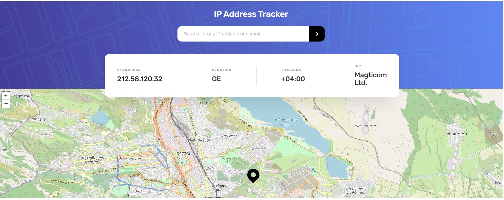

# IP address tracker React + TypeScript

## Table of contents

- [Overview](#overview)
  - [The challenge](#the-challenge)
  - [Screenshot](#screenshot)
  - [Links](#links)
- [My process](#my-process)
  - [Built with](#built-with)
- [Author](#author)

## Overview

### The challenge

Users should be able to:

- See their own IP address on the map on the initial page load
- Search for IP addresses and see the key information and location

### Screenshot

Device 375px/800px

### Links

- Solution URL: [GitHub](https://github.com/Nikkakko/IP-Address-Tracker)
- Live Site URL: [GitHub Pages](https://app.netlify.com/sites/nikako-ip-addres-tracker/settings/general)

## My process

### Built with

- [React](https://reactjs.org/) - JS library
- [TypeScript](https://www.typescriptlang.org/) - For types
- [Styled Components](https://styled-components.com/) - For styles
- [Axios](https://axios-http.com/) - For Requests
- [LeafletJS](https://leafletjs.com/) - For Map
- [React Leaflet](https://react-leaflet.js.org/)
- [Geolocation API by IPify](https://geo.ipify.org/) - For Ip and key information

## Author

- LinkedIn - [Nika Kopadze](https://www.linkedin.com/in/nika-kopadze-78a217256/)
